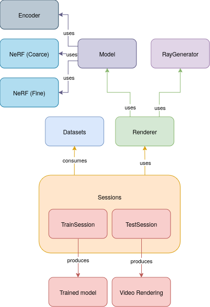

# PyNeRF, a Neural Radiance Field implementation in PyTorch

This repository contains a PyTorch implementation of the NeRF algorithm, as
described in the paper "NeRF: Representing Scenes as Neural Radiance Fields for
View Synthesis" by Ben Mildenhall, Pratul P. Srinivasan, Matthew Tancik,
Jonathan T. Barron, Ravi Ramamoorthi, Ren Ng. The paper can be found
[here](https://arxiv.org/abs/2003.08934).

The code in this repository is based on the original NeRF implementation by
@bmild, which can be found [here](https://github.com/bmild/nerf). The code has
been however heavily refactored and modified for better readability and
understanding.

## Run the code

As of now, the code only supports training on the synthetic "Blender" dataset.
Simply run the following command:

```bash
# Example for training with lego scene:
python3 -m nerf.main --config configs/lego.conf --train

# Example for testing with lego scene:
python3 -m nerf.main --config configs/lego.conf
```

## Architecture of the project


